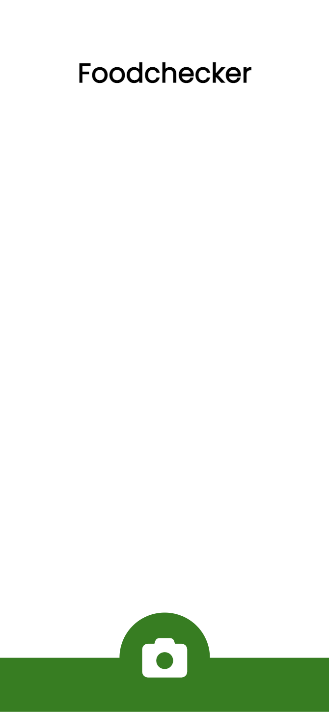
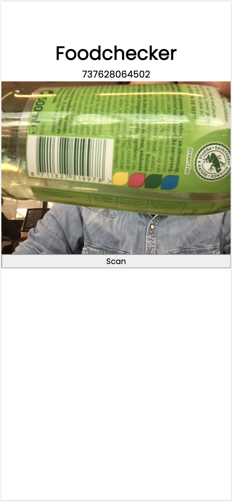
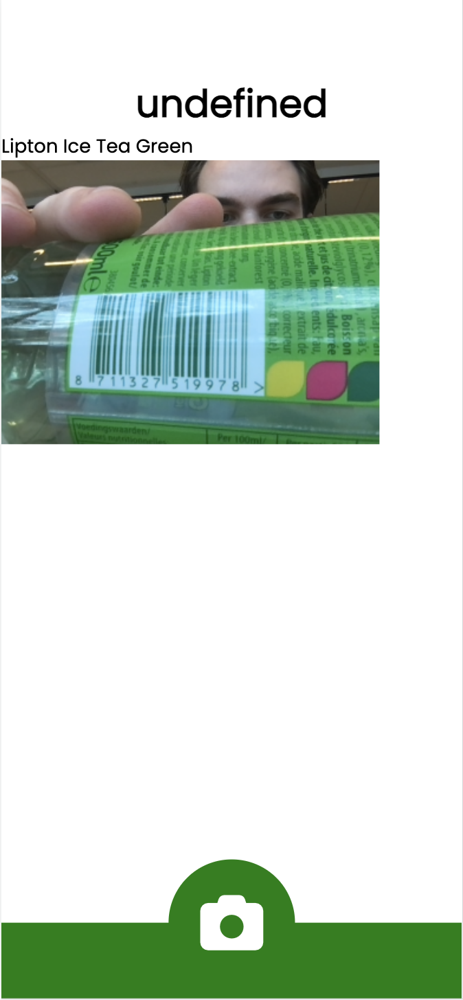
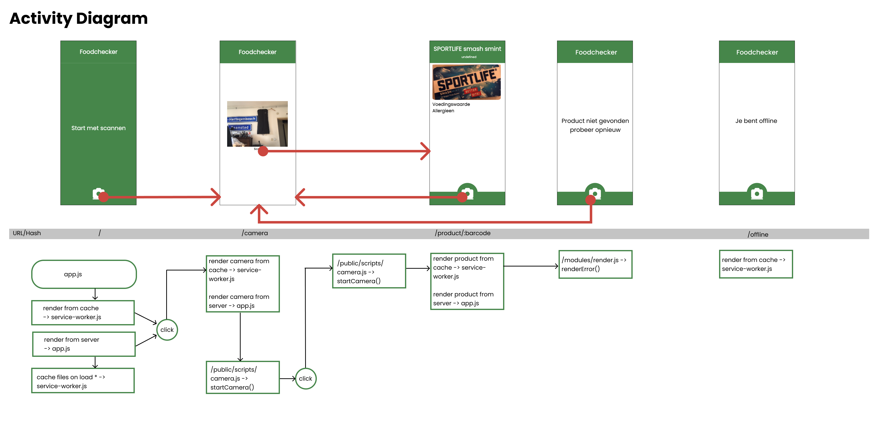

# Foodchecker

Foodchecker is a web application that uses the openfoodfacts API.

## What does it do?

The application let's you scan the barcode of a product. It uses the barcode scanner API, that currently is only available in google chrome. When it has scanned an barcode it looks through the openfoodfacts API. When it has found a matching product it displays the relevant information for the end user.

## Screenshots

## Activity Diagram

## Author

Application made by [Remco Kuckelkorn](https://github.com/Kuckelkorn) for the course [Web applications from scratch](https://github.com/cmda-minor-web/web-app-from-scratch-2122)
