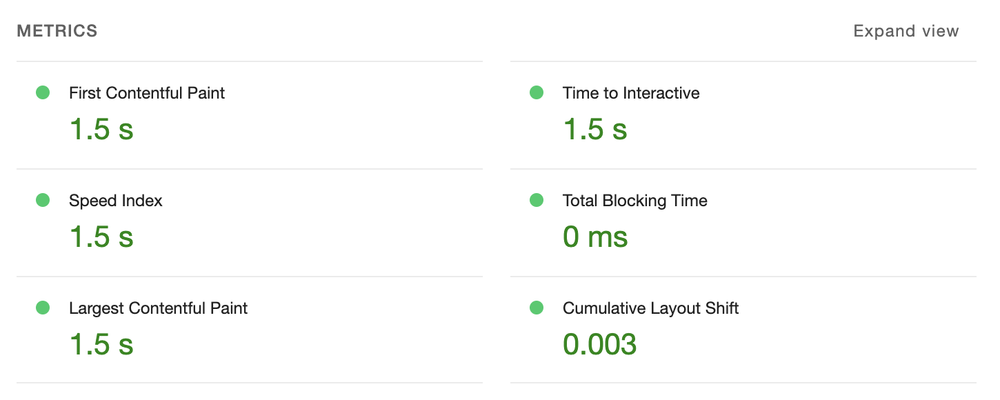

# Foodchecker 🍫

Foodchecker is a web application that uses the openfoodfacts API.

## 🙋 What does it do?

The application let's you scan the barcode of a product. It uses the barcode scanner API, that currently is only available in google chrome. When it has scanned an barcode it looks through the openfoodfacts API. When it has found a matching product it displays the relevant information for the end user.

### Screenshots


### Activity Diagram


## 🏃🏼 Running the app

### API's

The application uses the pug rendering engine for displaying the content and express to setup a server.
Besides that it uses [the barcode detection API](https://developer.mozilla.org/en-US/docs/Web/API/Barcode_Detection_API) and the [OpenFoodfacts API](https://world.openfoodfacts.org/)

### Tech stack

- Node.js
- Express
- Pug
- Compression
- Minify

### Service worker

#### What is a service worker?

> Service workers essentially act as proxy servers that sit between web applications, the browser, and the network (when available). They are intended, among other things, to enable the creation of effective offline experiences, intercept network requests and take appropriate action based on whether the network is available, and update assets residing on the server. They will also allow access to push notifications and background sync APIs.

[source: mdn](https://developer.mozilla.org/en-US/docs/Web/API/Service_Worker_API)

#### Implementation

The implementation of the service worker in my application includes the caching of core files in the `CORE_CACHE` and stores them in `core_name` which is the name of where it is stored. So when someone opens the website for the first time, all the files it needs to use for the page and the files stored in the `CORE_CACHE` are being downloaded. So whenever someone revisits the website, the service worker will first check if the files are in `CORE_CACHE` if they are they don't have to be downloaded from the server and are instead loaded in from the cache stored in the browser. If the file isn't in the cache storage, then it downloads the file from the server and if it is an html file, it will store it in the `html_cache`, otherwise it doesn't store it and it has to be redownloaded whenever the site is revisted e.g. images. 

### 🚧 Installation

#### 1. Clone the repository

The repository can be cloned by running `git clone` in the command line.

```zsh
git clone https://github.com/Kuckelkorn/foodchecker-pwa
```

#### 2. Install the packages

Install the dependencies with npm.

```node
npm install
```

### Running and viewing the application

Start the server with `npm run ndmStart`, you can view it by going to `localhost:5555` or a different specified port in your .env file

```node
1. npm run ndmStart
2. open your browser of choice and go to localhost:5555
```

## 🎖 Performance

### Lighthouse performance




## 🦧 Author

Application made by [Remco Kuckelkorn](https://github.com/Kuckelkorn) for the course [Progressive Web Apps](https://github.com/cmda-minor-web/progressive-web-apps-2122)
